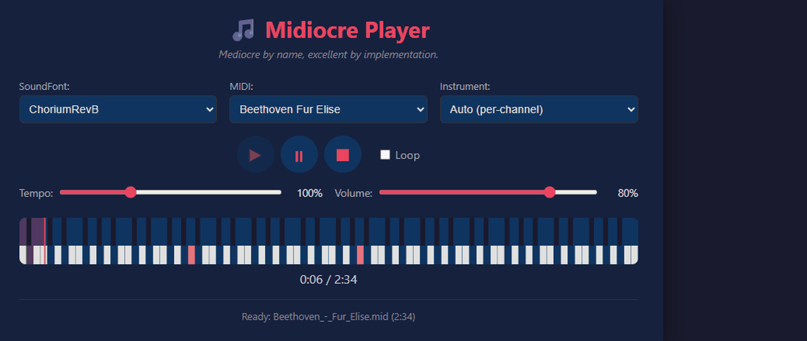

# Midiocre

**Mediocre by name, excellent by implementation.**

A standalone, high-performance, browser-first MIDI playback library with SoundFont 2 support. Built entirely in TypeScript with zero runtime dependencies — no external MIDI parsers, synth libraries, or playback engines.

Note: this project was prompted into existence in about two hours to support another project that I keep intentionally dependency‑free — my own libs were a pass ;-).

[Live demo (GitHub Pages) — https://putersdcat.github.io/MIDIocre/](https://putersdcat.github.io/MIDIocre/)

[](https://putersdcat.github.io/MIDIocre/)


> Demo screenshots — click the link above to open the live demo (GitHub Pages). The slideshow is automatically generated by CI from screenshots of all available themes. You can regenerate it locally with:
>
> 1. npm run readme:screenshots  # Takes screenshots of all themes
> 2. npm run readme:slideshow -- --cycle-themes  # Creates animated GIF
>
> The scripts process screenshots in .playwright-mcp, crop them uniformly, and produce assets/readme-slideshow.gif.

The demo is published automatically by the .github/workflows/deploy-demo.yml workflow.

## Features

- **Complete MIDI parser** — SMF format 0/1/2, VLQ, running status, all channel messages, meta events, sysex
- **Full SF2 parser** — RIFF/sfbk, INFO, sdta, pdta hydra (phdr through shdr), spec-compliant
- **Web Audio synthesizer** — Polyphonic voice engine with SF2 sample playback, envelopes, and articulation
- **Precision scheduler** — Low-jitter event scheduling via Web Audio timebase with lookahead
- **Rich transport** — Play/pause/stop/seek/loop with real-time tempo scaling
- **SF2 CLI tool** — Node.js CLI for SoundFont inspection, validation, extraction, and repacking
- **Demo player** — Full-featured browser demo with piano canvas, hot-swap, and configurable controls
- **State serialization** — Save and restore playback state (`getState`/`restoreState`)

## Quick Start

```bash
# Install
npm install

# Build everything (library + demo + CLI)
npm run build

# Start dev server with hot reload
npm run dev
# → http://localhost:3000

# Type check
npm run typecheck
```

## Integration

```typescript
import { Midiocre } from 'midiocre';

const player = new Midiocre({ volume: 0.8, loop: true });

// Load SoundFont and MIDI file
await player.loadSF2('/path/to/soundfont.sf2');
await player.loadMIDI('/path/to/song.mid');

// Transport controls
player.play();
player.pause();
player.stop();
player.seek(30); // seek to 30 seconds

// Adjust in real-time
player.tempo = 1.5;   // 150% speed
player.volume = 0.6;  // 60% volume
player.loop = true;

// State serialization
const state = player.getState();
player.restoreState(state);

// Cleanup
player.destroy();
```

## API Reference

### `new Midiocre(config?)`

Create a new player instance.

| Config Option | Type | Default | Description |
|---|---|---|---|
| `sf2Path` | `string` | `'/SoundFonts'` | Base path for SF2 files |
| `midiPath` | `string` | `'/DemoMidiFiles'` | Base path for MIDI files |
| `sf2Files` | `string[]` | `[]` | Available SF2 filenames |
| `midiFiles` | `string[]` | `[]` | Available MIDI filenames |
| `volume` | `number` | `0.8` | Master volume (0–1) |
| `tempo` | `number` | `1.0` | Tempo multiplier |
| `loop` | `boolean` | `false` | Loop playback |
| `autoplay` | `boolean` | `false` | Auto-play on load |

### Loading

- `loadSF2(source: string | ArrayBuffer | File): Promise<void>` — Load SoundFont
- `loadMIDI(source: string | ArrayBuffer | File): Promise<void>` — Load MIDI file

### Transport

- `play()` / `pause()` / `stop()` — Playback controls
- `seek(seconds: number)` — Seek to position
- `state` — Current state: `'stopped'` | `'playing'` | `'paused'`
- `currentTime` / `duration` — Playback position in seconds

### Properties

- `volume` — Master volume (0–2, getter/setter)
- `tempo` — Tempo multiplier (0.1–4, getter/setter)
- `loop` — Loop toggle (getter/setter)

### Discovery

- `listSF2Files()` — List available SF2 filenames
- `listMIDIFiles()` — List available MIDI filenames
- `listPresets()` — List presets from loaded SF2

### Configuration

- `getConfig()` — Get current config
- `configure(partial)` — Merge partial config

### State

- `getState(): MidiocreState` — Serialize current state
- `restoreState(state: MidiocreState)` — Restore state

### Callbacks

- `onStateChange(cb)` — Transport state change
- `onProgress(cb)` — Playback progress (time, duration)
- `onEvent(cb)` — MIDI event fired

### Instrument Selection

- `setInstrument(presetIndex)` — Force all channels to use a specific preset (-1 = auto)

## SF2 CLI Tool

```bash
# Build CLI
npm run build:cli

# Usage
node dist/cli/sf2cli.mjs <command> <sf2-file> [options]

# Commands
node dist/cli/sf2cli.mjs info SoundFonts/AWE32.sf2
node dist/cli/sf2cli.mjs presets SoundFonts/ChoriumRevB.sf2
node dist/cli/sf2cli.mjs instruments SoundFonts/General808.sf2
node dist/cli/sf2cli.mjs samples SoundFonts/MIRACLE.sf2
node dist/cli/sf2cli.mjs mappings SoundFonts/AWE32.sf2
node dist/cli/sf2cli.mjs validate SoundFonts/AWE32.sf2

# JSON output
node dist/cli/sf2cli.mjs presets SoundFonts/AWE32.sf2 --json

# Extract specific presets to new SF2
node dist/cli/sf2cli.mjs extract SoundFonts/AWE32.sf2 -p 0 -p 5 -o custom.sf2

# Clean repack
node dist/cli/sf2cli.mjs repack SoundFonts/AWE32.sf2 -o clean.sf2
```

## Demo Player

The demo player implements all controls from `DEMO_CONTROLS.md`:

- **Transport**: Play / Pause / Stop
- **Sliders**: Tempo (10–300%) and Volume (0–100%)
- **Dropdowns**: SoundFont, MIDI file, Instrument (preset-level)
- **Loop toggle**
- **Piano canvas**: visual note display + click-to-seek
- **Progress + time display**

### Config Precedence

1. Built-in defaults
2. `demo-player.config.json`
3. `window.MidiocrePlayerConfig`
4. `window.player.configure(...)`

### Runtime API (Demo)

```javascript
window.player.listSF2Files()
window.player.listMIDIFiles()
window.player.getConfig()
window.player.configure({ volume: 0.5 })
window.player.getState()
window.player.restoreState(state)
window.player.audioContext       // AudioContext instance (available after an SF2 is loaded)
window.player.outputNode         // Output / destination node (useful for splicing an AnalyserNode)
```

## Architecture

```
src/
  midi/          Parser + event model + tempo map
  sf2/           RIFF + hydra parser + builder
  synth/         Voices, envelopes, mixing
  engine/        Scheduler + transport
  api/           Public facade
  demo/          Browser UI
  cli/           SF2 CLI tool
```

## Build Commands

| Command | Description |
|---|---|
| `npm run build` | Build everything |
| `npm run build:lib` | Build library ESM bundle |
| `npm run build:demo` | Build demo app |
| `npm run build:cli` | Build CLI tool |
| `npm run dev` | Start dev server (watch mode) |
| `npm run typecheck` | TypeScript type checking |

## Sound Fonts ???
 - https://ia600401.us.archive.org/view_archive.php?archive=/16/items/500-soundfonts-full-gm-sets/500_Soundfonts_Full_GM_Sets.zip

## Spec Compliance

- **MIDI**: Standard MIDI File Spec 1.1 — Format 0/1/2, VLQ, running status, all meta events
- **SF2**: SoundFont 2.01 Technical Specification — RIFF/sfbk, hydra (9 sub-chunks), generator enumerators, zone architecture
- Unknown chunks are gracefully skipped (MIDI) or ignored (SF2 INFO sub-chunks)
- Fixed ordering enforced for pdta hydra sub-chunks

## License

CC0 1.0 Universal — public domain dedication. You may copy, modify, distribute, and perform the work, even for commercial purposes, all without asking permission. See the LICENSE file for details.
